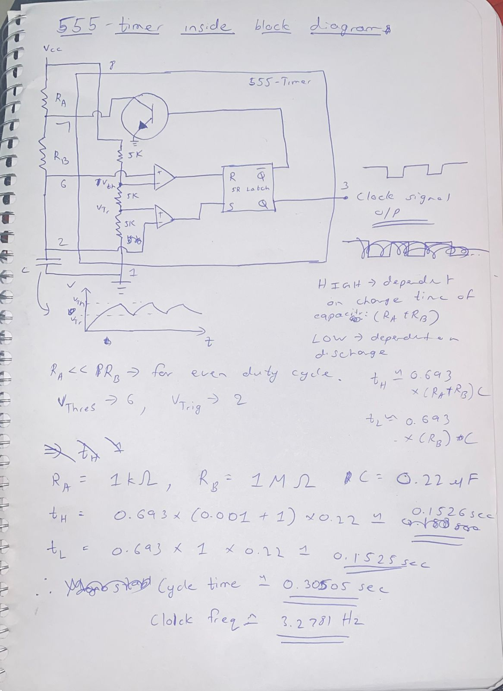
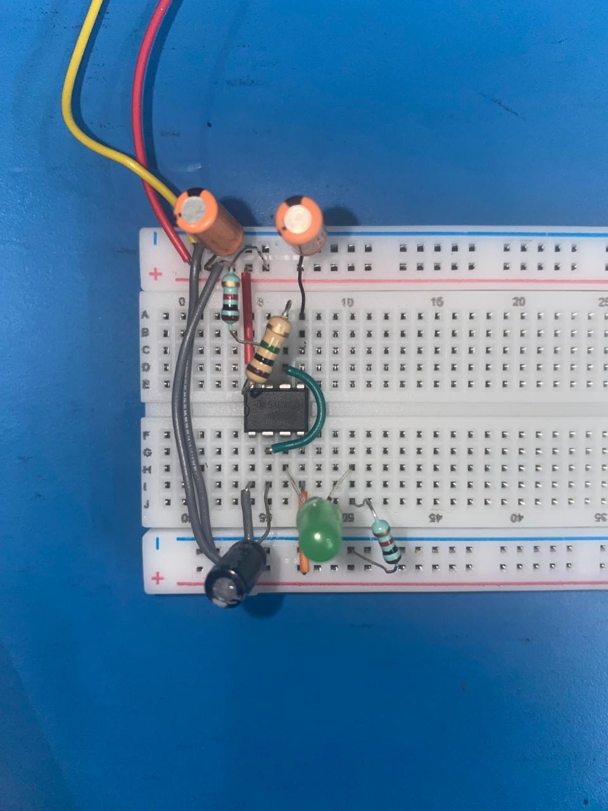

# Day 1 - 9th September, 2025

Finally with my mid semester exams over with, and all the parts arrived, I can finally start work on this project.

I will first begin with a basic clock design using a 555 timer chip, intending to make astable, monostable and bistable circuits on a single breadboard.

Reading up on the datasheet and a Ben Eater video covering the topic, I learnt the basic mechanism of a 555 timer, and selected the resistor and capacitor values minimizing the uneven duty cycle and getting an even nice pulse of about 3.2781 Hz. An improvement I could make later adding a potentiometer to vary the R_b resistance and hence the cycle time, I'll probably do that next time I work on this, along with making the monostable and bistable versions of the clock circuit. 

##### Here's some notes I took while learning and calculating the cycle time:

##### Here's the circuit:

The circuit follows the recommendations in the data sheet to HIGH the reset pin and also a 0.1 microFarad capacitor across the supply, and one between the 5th pin and ground to denoise and prevent overshooting.

All thats left now is to take this thing to the lab to check it out with an oscilloscope to see how much error is there from the expected theoretical values.

### Resources used:
[Ben Eater on YT](https://www.youtube.com/playlist?list=PLowKtXNTBypGqImE405J2565dvjafglHU)
[555 TI Datasheet](https://www.ti.com/lit/ds/symlink/ne555.pdf?ts=1757424612211&ref_url=https%253A%252F%252Fwww.ti.com%252Fproduct%252FNE555%252Fpart-details%252FNE555P)
