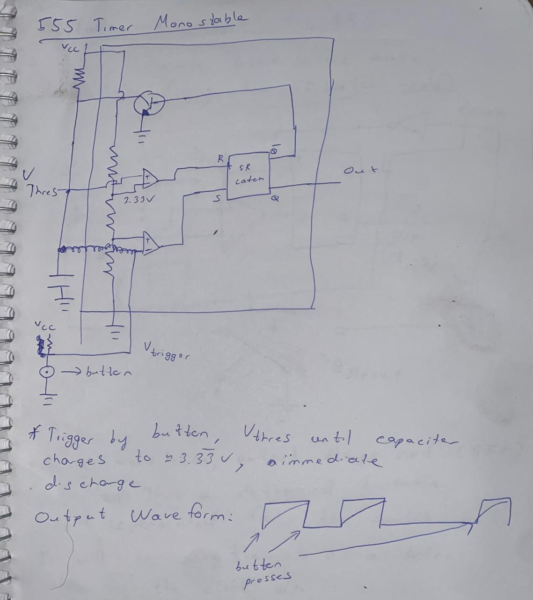
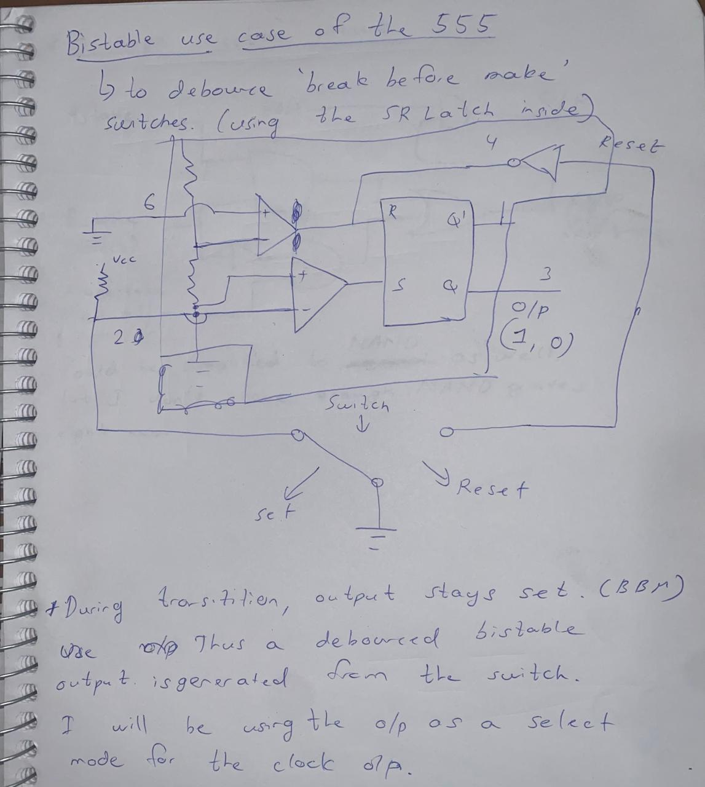
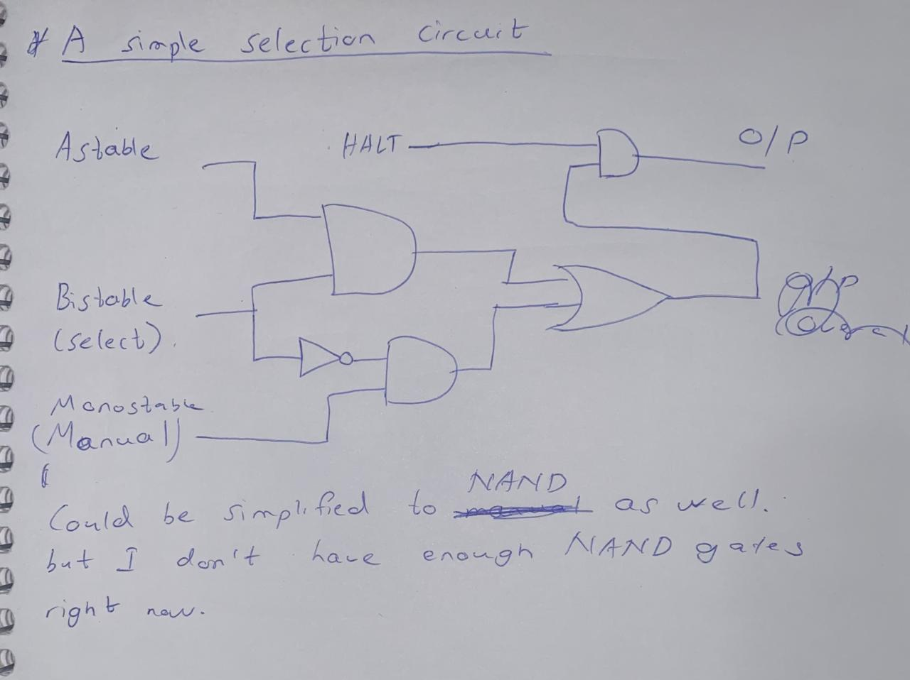

# Day 2 - 20th September, 2025

It's been a while, I've been holding this off for the most part because I had other work in between, but I have finished the majority of the clock module, by making astable and monostable versions of the circuit and a switching circuit between them. I had spent some time before this and the last entry learning about how these circuits work and my casual notes are also seen below. All I did today was assemble this guy and get him working. 

Also good news, the noise in the signal I made in the last entry is indeed minimal, I forgot to take a picture of the oscilloscope reading, but will do it if I end up going to the lab to test this version out. 

##### Here are the notes I took while learning:

Today I have completed the monostable circuit with a 1M Ohm resistor and a 0.5 microfarad capacitor, which should give me around 0.5 seconds of debounced time, for my output wave, again need to confirm this with an oscilloscope in the lab later on.

The bistable circuit and the selection circuit are all thats left for this clock module to be done though, and with that it will be ready for my 6502 chip. 

##### Here's the current circuit (with the monostable added on):

### Resources used:
[Ben Eater on YT](https://www.youtube.com/playlist?list=PLowKtXNTBypGqImE405J2565dvjafglHU)
[555 TI Datasheet](https://www.ti.com/lit/ds/symlink/ne555.pdf?ts=1757424612211&ref_url=https%253A%252F%252Fwww.ti.com%252Fproduct%252FNE555%252Fpart-details%252FNE555P)

