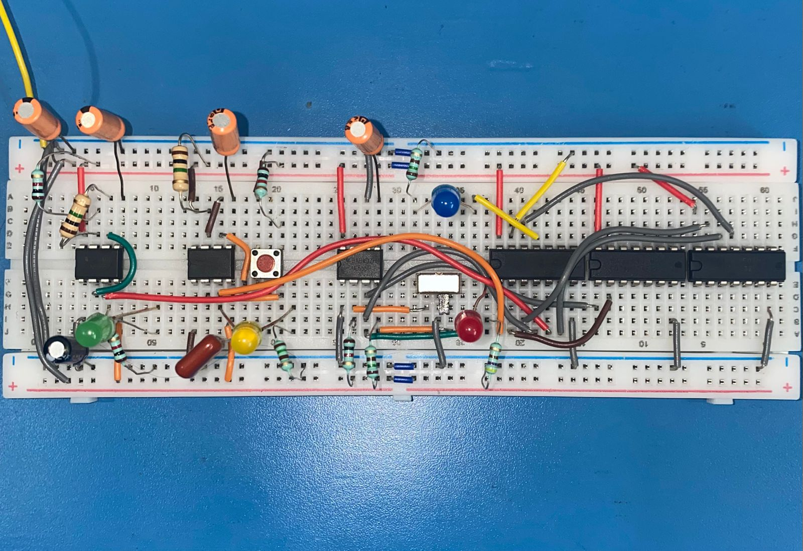

# Day 3 - 3rd October, 2025

Been awhile, alot of stuff has happened in between but today I finally got some time to implement the final stage of the clock module. Now we officially have a switch (debounced using a bistable 555 waveform), that we can use to swtich between the monostable waveform and the astable waveform into one output using the notes I showed in the previous journal entry. The selector is fed into a simple logic circuit to decide what the final output waveform should be. With this implemented, the clock module is completed and we can finally move onto tinkering with the project title, i.e the 6502 microprocessor, which I will be doing in the next journal entry.

#### Anyways, blabbering aside here's the circuit I have right now:

This represents a 'complete' clock module for the purposes of this project but it does have scope for improvement which I will list as TODOs down below:

TODOs:

- Add potentiometer for the astable mode to adjust frequency
- Fix some of the more cringeworthy cable managment
- The selection switch is in an awkward place, which I personally think is functional enough but I'd like to find a better for it.
- Maybe remove the astable and monostable LEDs. 
- Currently, the HALT complement input is just a wire connected to Vcc, but maybe make it more convienient to HALT the clock.
- Reduce logic wastage by converting to pure NAND gates.

I think most of these I can do without for now so I'll keep this as low priority, mostly cuz I want to start messing with the 6502 asap. 

A final oscilloscope check, to make sure everythingg is working properly would also be worthwhile.

### Resources used:
[Ben Eater on YT](https://www.youtube.com/playlist?list=PLowKtXNTBypGqImE405J2565dvjafglHU)
[555 TI Datasheet](https://www.ti.com/lit/ds/symlink/ne555.pdf?ts=1757424612211&ref_url=https%253A%252F%252Fwww.ti.com%252Fproduct%252FNE555%252Fpart-details%252FNE555P)
[SN74LS04 TI Datasheet](hhttps://www.ti.com/lit/ds/symlink/sn7404.pdf?ts=1759442912987&ref_url=https%253A%252F%252Fwww.ti.com%252Fproduct%252FSN7404%253Fbm-verify%253DAAQAAAAM_____7vG_4vkJYaf-RTHNTVu-c_Km7ZypFqC0rKq2affstOFFrNsc5VcY8cZXphG27KGE4LUr53zoFVW0gl0YIfmvmfCWIaQ73HchZwvW7OKrxK1KDO6-Y6nyyXUGg9fQ3QilCYZV_cnCUuXRcUmPhOWqiV0qdUoHsbND29mObAL6HLluXLMtpQKLOemgSrTE1KJIbxjhHExZxVcWTDk0WO8wn_ENaYvLOzFcGvj5vvDCZa8IrfyD95NLeVNcV7eGGLlmGB9Z3EzYhAIpY9g_35TTUk8IfLx1abU7HB5)
[SN74LS08 TI Datasheet](https://www.ti.com/lit/ds/symlink/sn74ls08.pdf?ts=1759400113461&ref_url=https%253A%252F%252Fwww.ti.com%252Fproduct%252FSN74LS08)
[SN74LS32 TI Datasheet](https://www.ti.com/lit/ds/symlink/sn7432.pdf?ts=1759443233456&ref_url=https%253A%252F%252Fwww.ti.com%252Fproduct%252FSN7432)